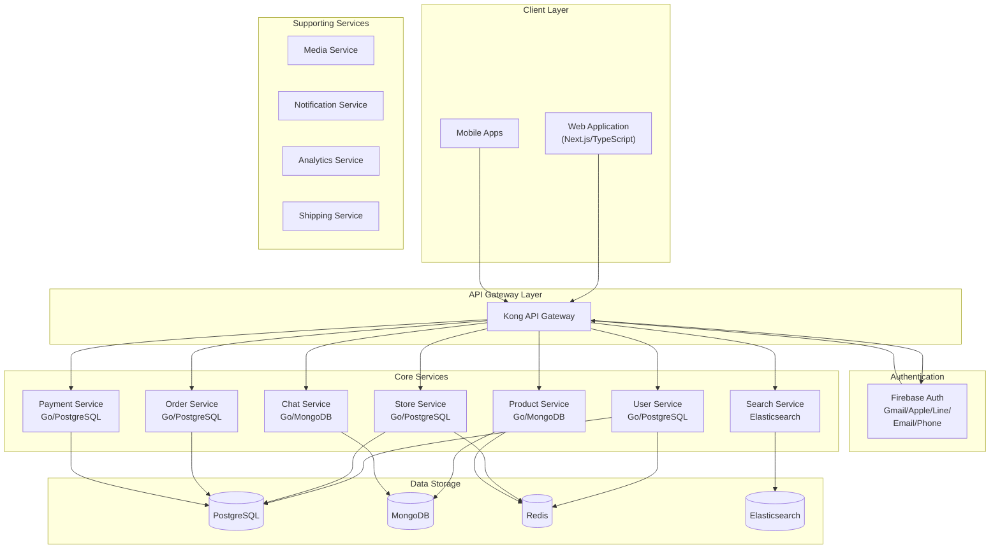
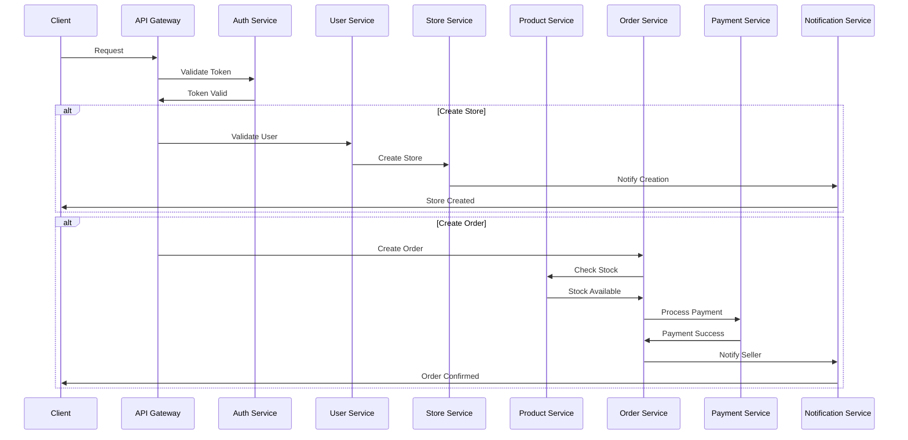
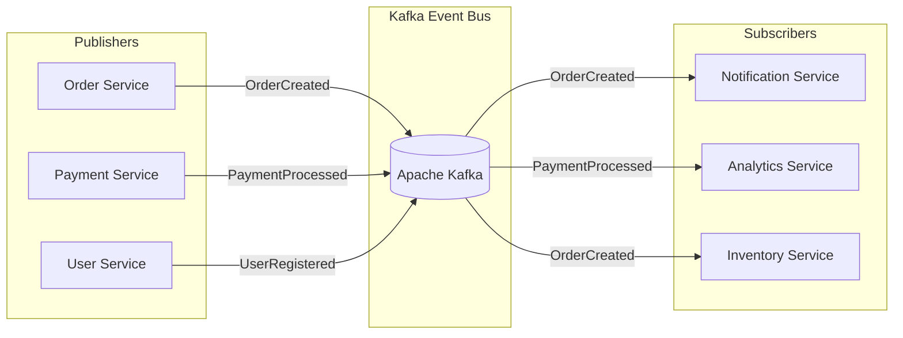
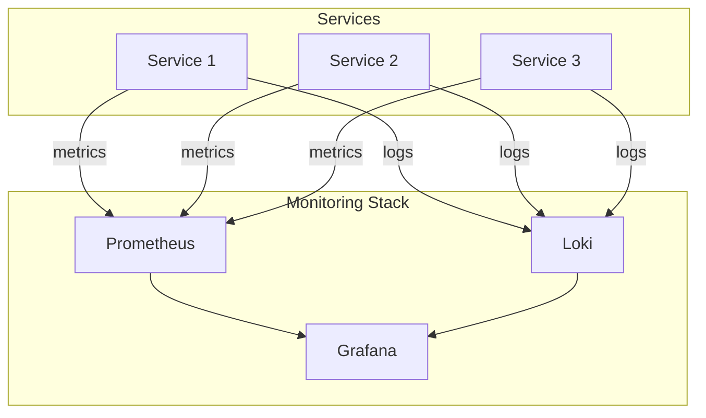
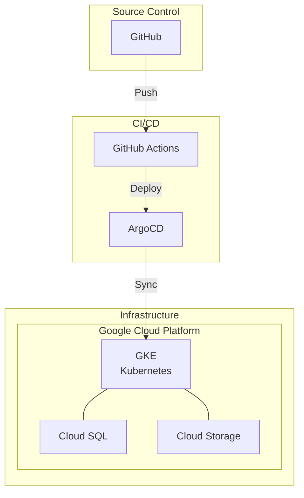
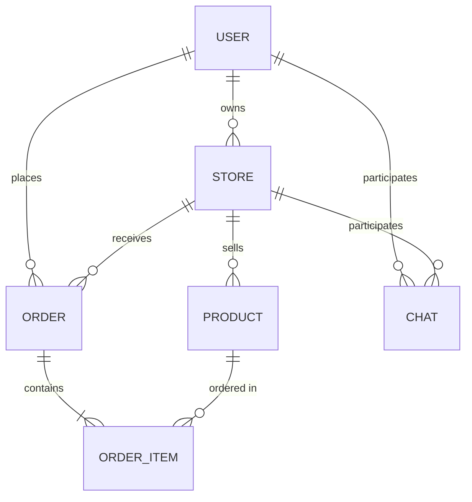
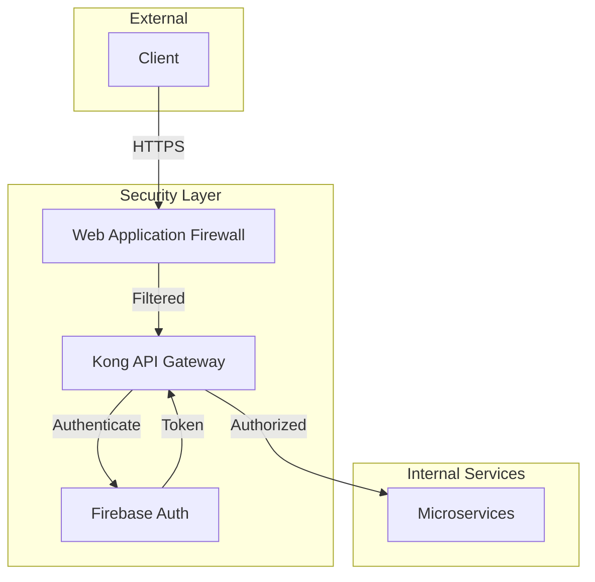
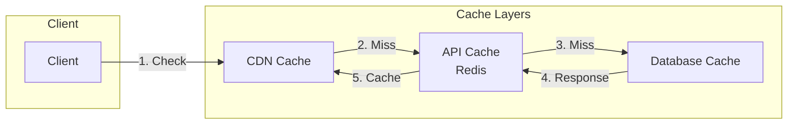
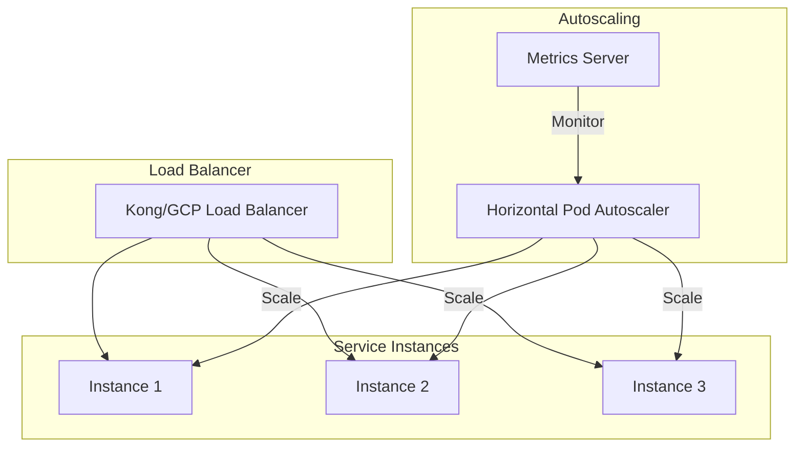

# Marketplace Microservices Architecture Diagrams
แผนภาพสถาปัตยกรรมไมโครเซอร์วิสสำหรับระบบมาร์เก็ตเพลส

## High-Level Architecture Overview
ภาพรวมสถาปัตยกรรมระดับสูง

## Service Communication Flow
การไหลของการสื่อสารระหว่างเซอร์วิส

## Event-Driven Architecture
สถาปัตยกรรมแบบขับเคลื่อนด้วยเหตุการณ์

## Monitoring & Logging Architecture
สถาปัตยกรรมการติดตามและบันทึก

## Deployment Architecture
สถาปัตยกรรมการติดตั้ง

## Database Relations
ความสัมพันธ์ของฐานข้อมูล

## Security Architecture
สถาปัตยกรรมความปลอดภัย

## Cache Strategy
กลยุทธ์การแคช

## Service Scaling Strategy
กลยุทธ์การปรับขนาดเซอร์วิส

