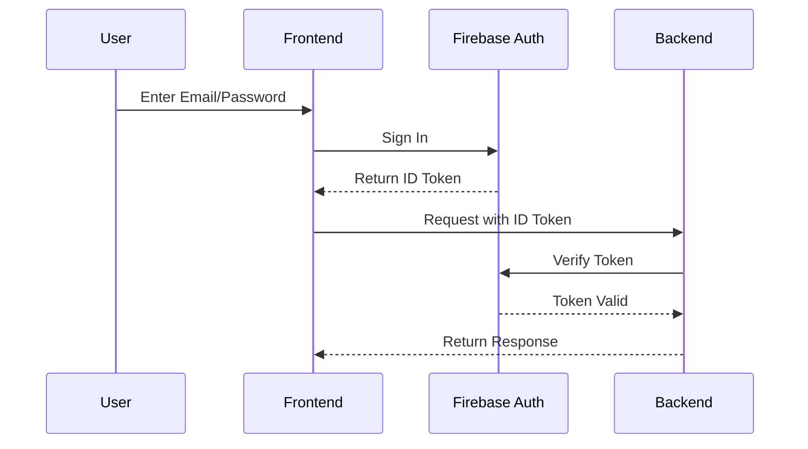
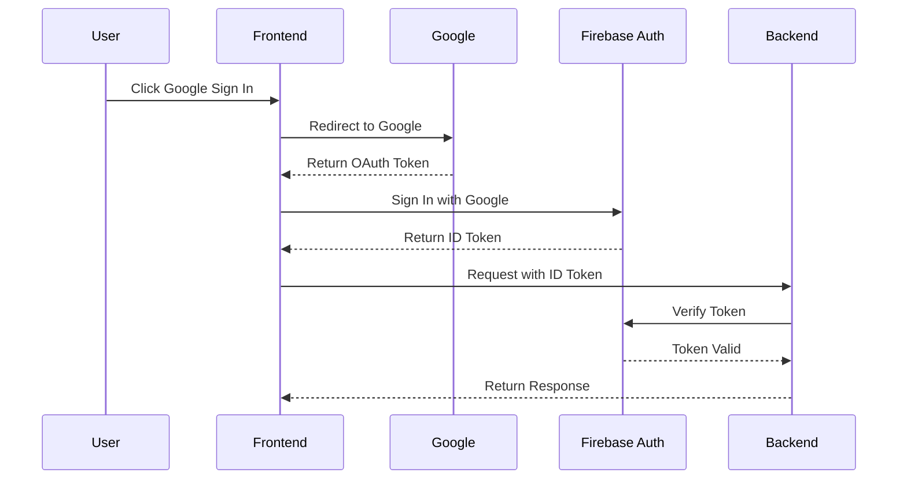
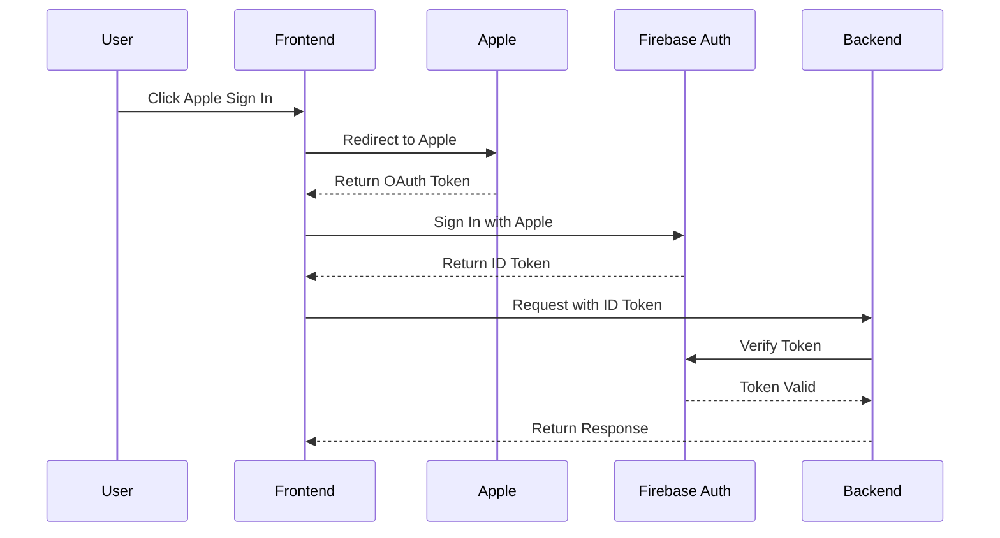
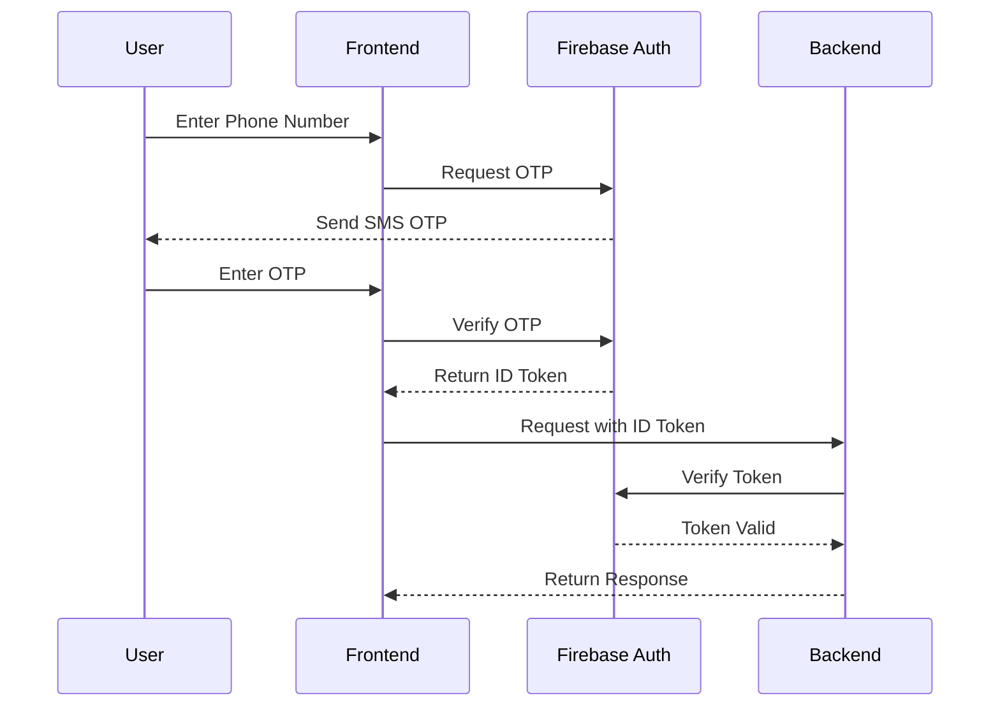
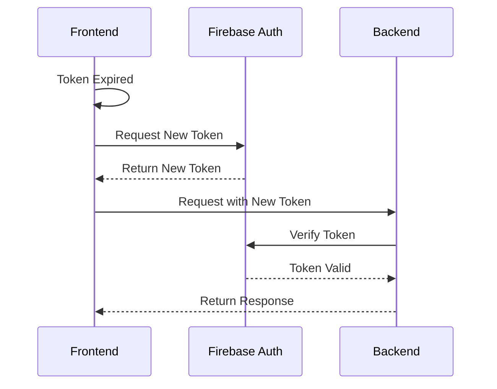

# Authentication Flow
การทำงานของระบบยืนยันตัวตน

## Firebase Authentication Flows

### Email/Password Authentication


### Google Authentication


### LINE Authentication


### Apple Sign In


### Phone Authentication


## Token Management

### Token Structure
```json
{
    "iss": "https://securetoken.google.com/<project-id>",
    "aud": "<project-id>",
    "auth_time": 1234567890,
    "user_id": "firebase-user-id",
    "sub": "firebase-user-id",
    "iat": 1234567890,
    "exp": 1234567890,
    "email": "user@example.com",
    "email_verified": true,
    "phone_number": "+66812345678",
    "name": "User Name",
    "picture": "https://example.com/photo.jpg",
    "provider_id": "google.com"
}
```

### Token Refresh Flow


## Security Considerations

### Token Validation
1. Verify token signature
2. Check token expiration
3. Validate issuer (iss)
4. Validate audience (aud)
5. Check token not revoked

### Session Management
1. Token expiration time
2. Refresh token rotation
3. Force logout capabilities
4. Multiple device sessions

### Security Headers
```
X-Frame-Options: DENY
X-Content-Type-Options: nosniff
Strict-Transport-Security: max-age=31536000; includeSubDomains
Content-Security-Policy: default-src 'self'
```
