# Database Diagrams for Marketplace Microservices
แผนภาพฐานข้อมูลสำหรับระบบมาร์เก็ตเพลส

## PostgreSQL Databases

### User Service Database
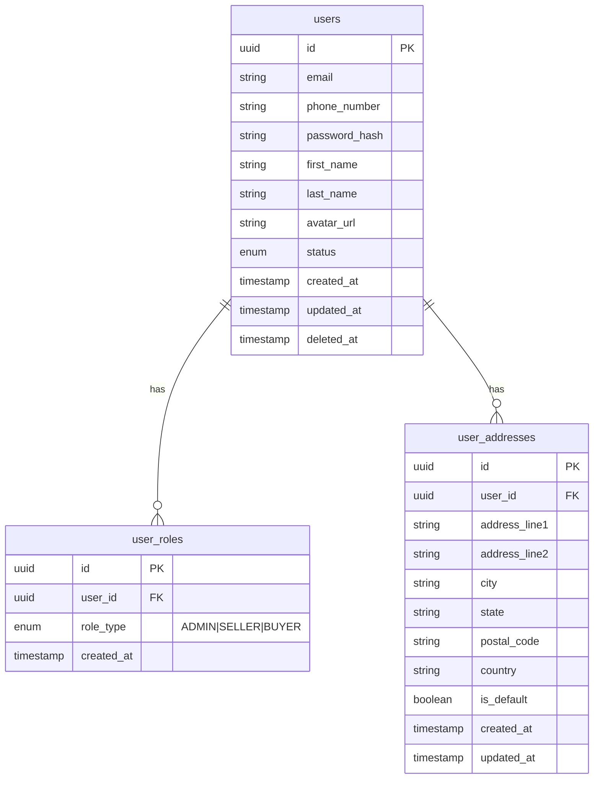

### Store Service Database
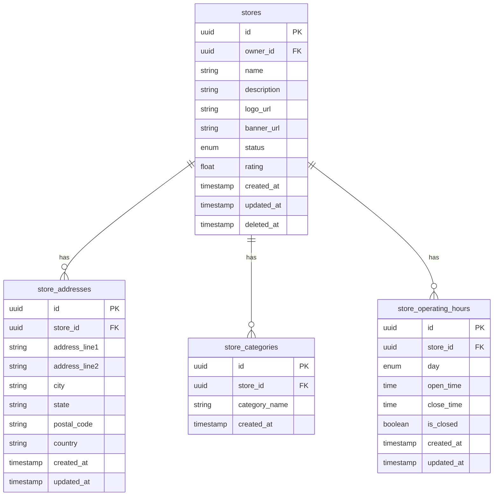

### Order Service Database
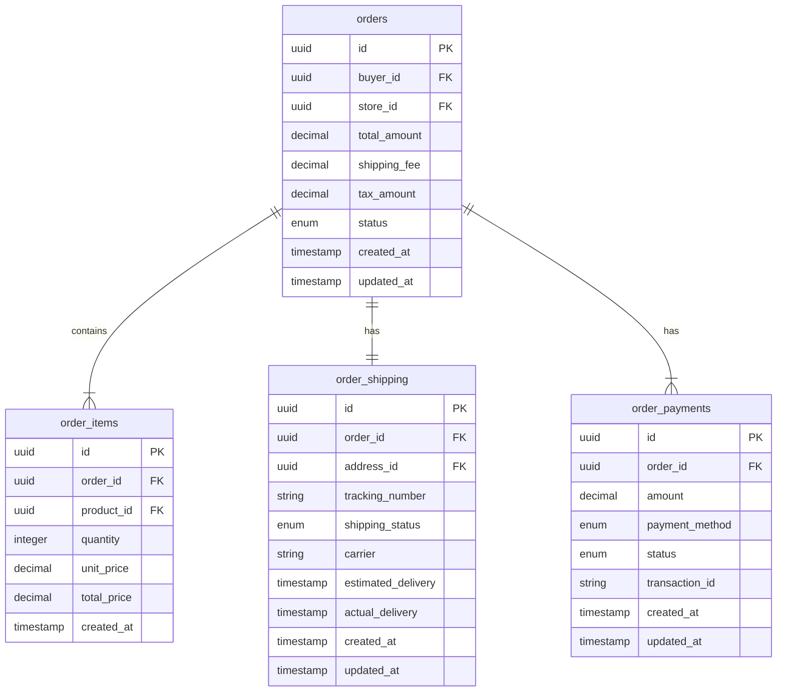

### Payment Service Database
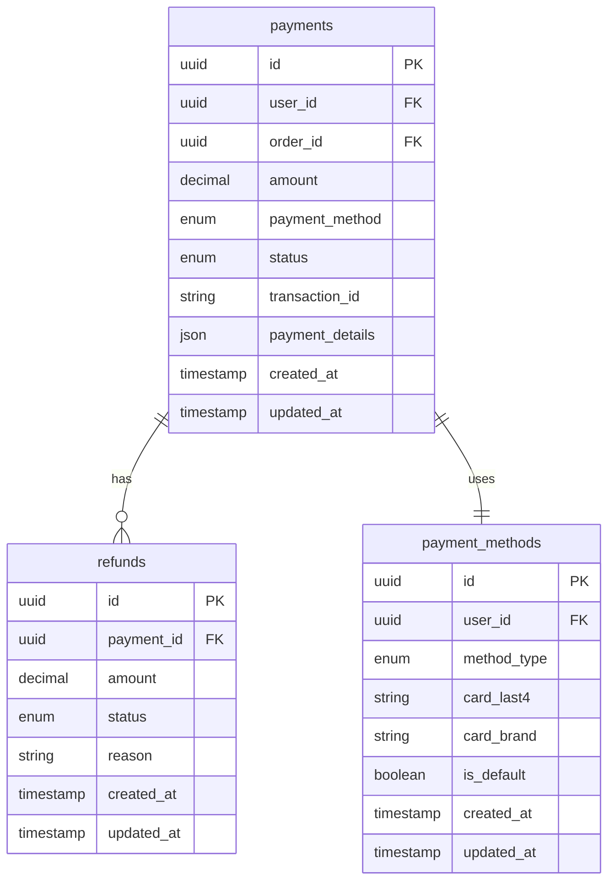

### Shipping Service Database
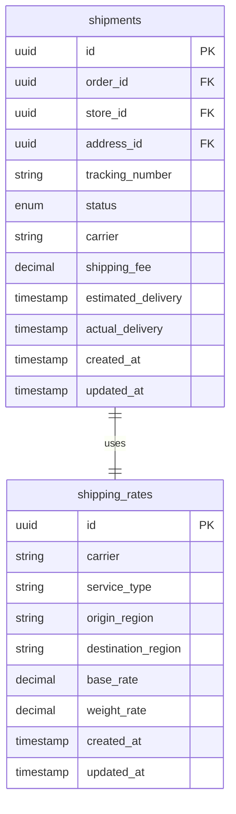

## MongoDB Collections

### Product Service Collections
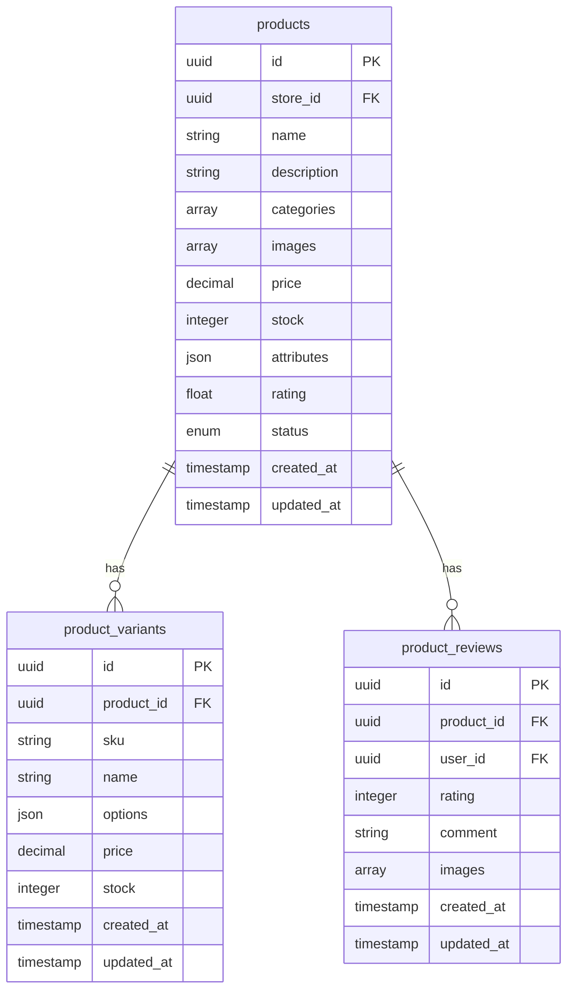

### Chat Service Collections
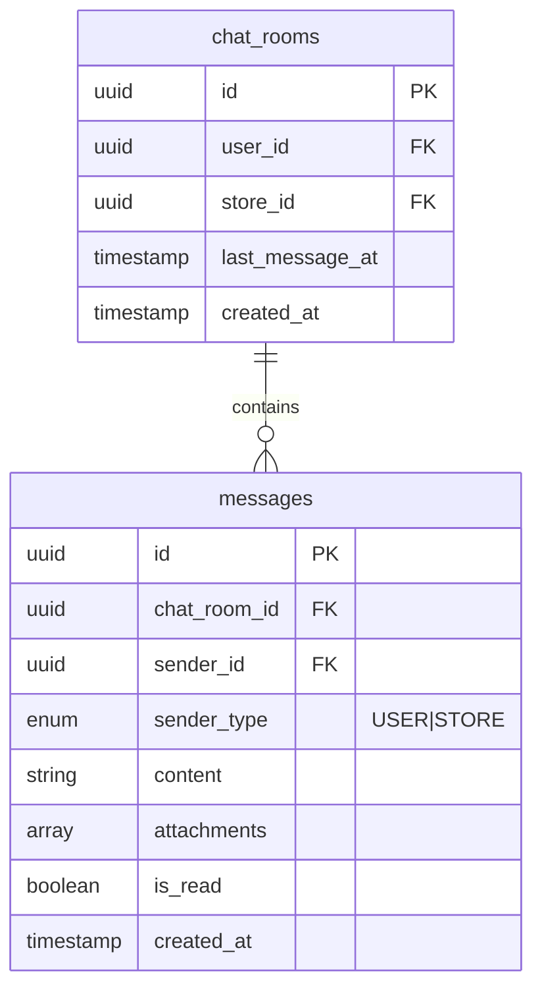

### Notification Service Collections
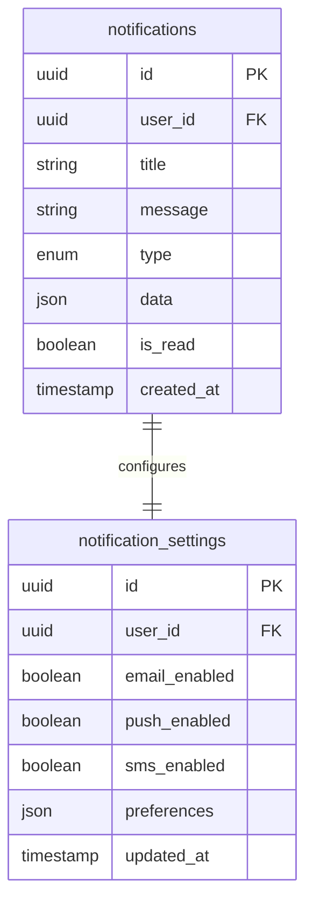

## Redis Data Structures

### Caching
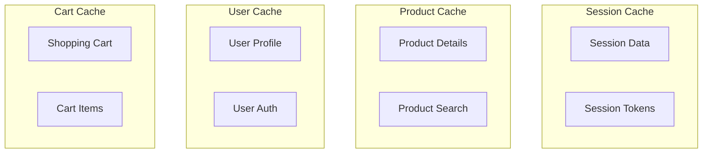

### Rate Limiting
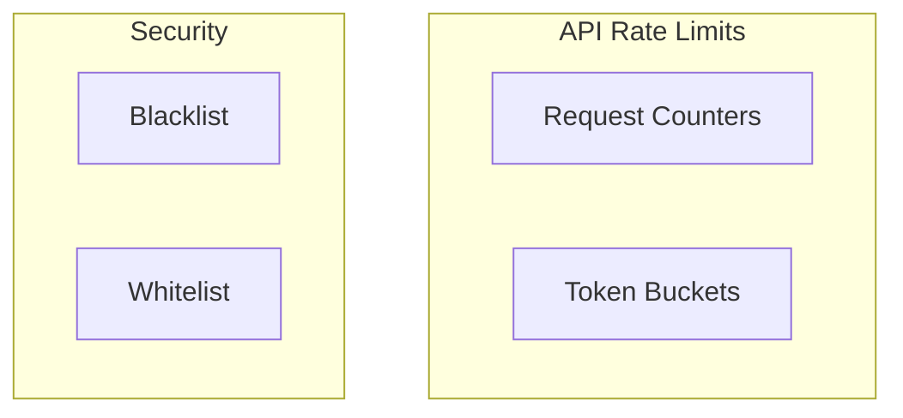

## Elasticsearch Indices

### Search Service Indices
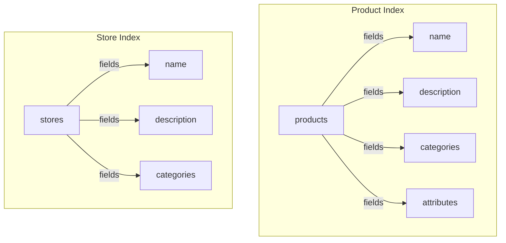
