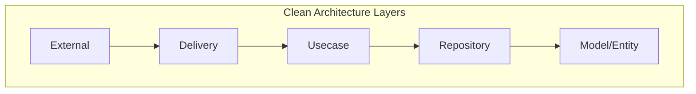

# Development Guidelines
แนวทางการพัฒนาสำหรับทีม

## Project Structure
โครงสร้างโปรเจค

```
marketplace-microservice/
├── services/
│   ├── user-store-service/
│   │   ├── cmd/
│   │   ├── internal/
│   │   │   ├── domain/
│   │   │   ├── repository/
│   │   │   ├── usecase/
│   │   │   └── delivery/
│   │   ├── pkg/
│   │   └── tests/
│   ├── product-service/
│   ├── order-service/
│   └── ...
├── infrastructure/
│   ├── terraform/
│   ├── kubernetes/
│   └── monitoring/
├── api/
│   ├── proto/
│   ├── graphql/
│   └── openapi/
└── docs/
```

## Coding Standards

### Go Code Style
```go
// Package naming
package users

// Interface naming
type UserRepository interface {
    // Method comments
    // GetByID retrieves a user by their ID
    GetByID(ctx context.Context, id string) (*User, error)
}

// Error handling
if err != nil {
    return fmt.Errorf("failed to get user: %w", err)
}

// Context usage
func (s *service) CreateUser(ctx context.Context, user *User) error {
    // Always pass context
    return s.repo.Create(ctx, user)
}
```

### TypeScript Code Style (Frontend)
```typescript
// Interface naming
interface UserProps {
  id: string;
  name: string;
  email: string;
}

// Component naming
const UserProfile: React.FC<UserProps> = ({ id, name, email }) => {
  // ...
};

// Async/await usage
const fetchUser = async (id: string): Promise<User> => {
  try {
    const response = await api.get(`/users/${id}`);
    return response.data;
  } catch (error) {
    throw new Error(`Failed to fetch user: ${error.message}`);
  }
};
```

## Clean Architecture


### Domain Layer
```go
// Entity definition
type User struct {
    ID        string    `json:"id"`
    Email     string    `json:"email"`
    CreatedAt time.Time `json:"created_at"`
}

// Value Objects
type Money struct {
    Amount   decimal.Decimal
    Currency string
}
```

### Repository Layer
```go
// Repository interface
type UserRepository interface {
    Create(ctx context.Context, user *User) error
    GetByID(ctx context.Context, id string) (*User, error)
    Update(ctx context.Context, user *User) error
    Delete(ctx context.Context, id string) error
}
```

### Usecase Layer
```go
// Usecase interface
type UserUsecase interface {
    CreateUser(ctx context.Context, input CreateUserInput) (*User, error)
    GetUser(ctx context.Context, id string) (*User, error)
}

// Usecase implementation
type userUsecase struct {
    repo UserRepository
}
```

### Delivery Layer
```go
// HTTP Handler
func (h *UserHandler) CreateUser(c *fiber.Ctx) error {
    var input CreateUserInput
    if err := c.BodyParser(&input); err != nil {
        return c.Status(400).JSON(ErrorResponse{Error: err.Error()})
    }
    // ...
}
```

## Error Handling

### Error Types
```go
// Custom error types
type NotFoundError struct {
    Resource string
    ID       string
}

func (e *NotFoundError) Error() string {
    return fmt.Sprintf("%s with ID %s not found", e.Resource, e.ID)
}
```

### Error Responses
```go
// Standard error response
type ErrorResponse struct {
    Code    string `json:"code"`
    Message string `json:"message"`
    Details any    `json:"details,omitempty"`
}
```

## Testing

### Unit Tests
```go
func TestUserService_CreateUser(t *testing.T) {
    // Arrange
    repo := mock.NewUserRepository()
    service := NewUserService(repo)
    
    // Act
    user, err := service.CreateUser(context.Background(), input)
    
    // Assert
    assert.NoError(t, err)
    assert.NotNil(t, user)
}
```

### Integration Tests
```go
func TestUserAPI_CreateUser(t *testing.T) {
    // Setup
    app := fiber.New()
    handler := NewUserHandler(userService)
    app.Post("/users", handler.CreateUser)
    
    // Test
    resp, err := app.Test(httptest.NewRequest("POST", "/users", body))
    
    // Assert
    assert.Equal(t, 200, resp.StatusCode)
}
```

## Logging

### Structured Logging
```go
// Logger setup
logger := zerolog.New(os.Stdout).With().Timestamp().Logger()

// Usage
logger.Info().
    Str("user_id", user.ID).
    Str("action", "create_user").
    Msg("Creating new user")
```

## Metrics

### Prometheus Metrics
```go
// Metric definitions
var (
    requestDuration = prometheus.NewHistogramVec(
        prometheus.HistogramOpts{
            Name: "http_request_duration_seconds",
            Help: "HTTP request duration in seconds",
        },
        []string{"method", "path"},
    )
)

// Usage
func measureDuration(next http.Handler) http.Handler {
    return http.HandlerFunc(func(w http.ResponseWriter, r *http.Request) {
        start := time.Now()
        next.ServeHTTP(w, r)
        duration := time.Since(start).Seconds()
        requestDuration.WithLabelValues(r.Method, r.URL.Path).Observe(duration)
    })
}
```

## Security

### Authentication
```go
// JWT Middleware
func AuthMiddleware() fiber.Handler {
    return func(c *fiber.Ctx) error {
        token := c.Get("Authorization")
        if token == "" {
            return c.Status(401).JSON(ErrorResponse{
                Code:    "unauthorized",
                Message: "Missing authorization token",
            })
        }
        // Verify token...
        return c.Next()
    }
}
```

### Input Validation
```go
// Validation struct
type CreateUserInput struct {
    Email    string `json:"email" validate:"required,email"`
    Password string `json:"password" validate:"required,min=8"`
}

// Validation usage
if err := validator.Struct(input); err != nil {
    return fmt.Errorf("invalid input: %w", err)
}
```

## API Documentation

### OpenAPI/Swagger
```yaml
openapi: 3.0.0
info:
  title: Marketplace API
  version: 1.0.0
paths:
  /users:
    post:
      summary: Create a new user
      requestBody:
        required: true
        content:
          application/json:
            schema:
              $ref: '#/components/schemas/CreateUserInput'
```

### GraphQL Schema
```graphql
type User {
  id: ID!
  email: String!
  profile: UserProfile
}

input CreateUserInput {
  email: String!
  password: String!
}
```

## Git Workflow

### Branch Naming
```
feature/user-authentication
bugfix/order-calculation
hotfix/security-patch
```

### Commit Messages
```
feat: add user authentication
fix: correct order calculation
docs: update API documentation
```

## CI/CD

### GitHub Actions
```yaml
name: CI/CD Pipeline

on:
  push:
    branches: [ main ]
  pull_request:
    branches: [ main ]

jobs:
  test:
    runs-on: ubuntu-latest
    steps:
      - uses: actions/checkout@v2
      - name: Run tests
        run: make test

  build:
    needs: test
    runs-on: ubuntu-latest
    steps:
      - name: Build and push
        run: |
          docker build -t app .
          docker push app
```

## Performance

### Caching Strategy
```go
// Redis caching
func (r *userRepository) GetByID(ctx context.Context, id string) (*User, error) {
    // Try cache first
    if cached, err := r.redis.Get(ctx, fmt.Sprintf("user:%s", id)).Result(); err == nil {
        var user User
        return &user, json.Unmarshal([]byte(cached), &user)
    }
    
    // Fallback to database
    user, err := r.db.GetUser(ctx, id)
    if err != nil {
        return nil, err
    }
    
    // Cache for next time
    cached, _ := json.Marshal(user)
    r.redis.Set(ctx, fmt.Sprintf("user:%s", id), cached, time.Hour)
    
    return user, nil
}
```

### Database Optimization
```sql
-- Indexes
CREATE INDEX idx_users_email ON users(email);
CREATE INDEX idx_orders_user_id ON orders(user_id);

-- Composite Indexes
CREATE INDEX idx_products_store_category ON products(store_id, category_id);
```

## Monitoring

### Health Checks
```go
// Health check endpoint
func (h *Handler) HealthCheck(c *fiber.Ctx) error {
    health := struct {
        Status    string `json:"status"`
        Timestamp string `json:"timestamp"`
    }{
        Status:    "healthy",
        Timestamp: time.Now().Format(time.RFC3339),
    }
    return c.JSON(health)
}
```

### Alerting Rules
```yaml
# Prometheus alerting rules
groups:
- name: app
  rules:
  - alert: HighErrorRate
    expr: rate(http_requests_total{status=~"5.."}[5m]) > 0.1
    for: 5m
    labels:
      severity: critical
```
