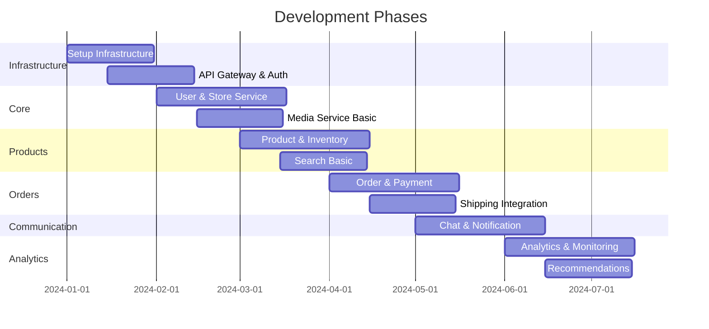
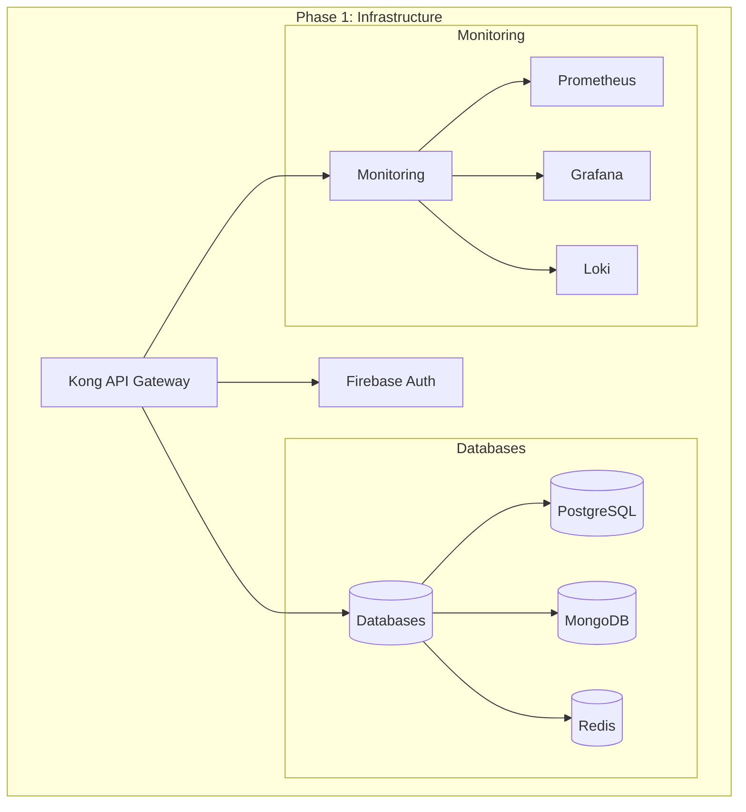
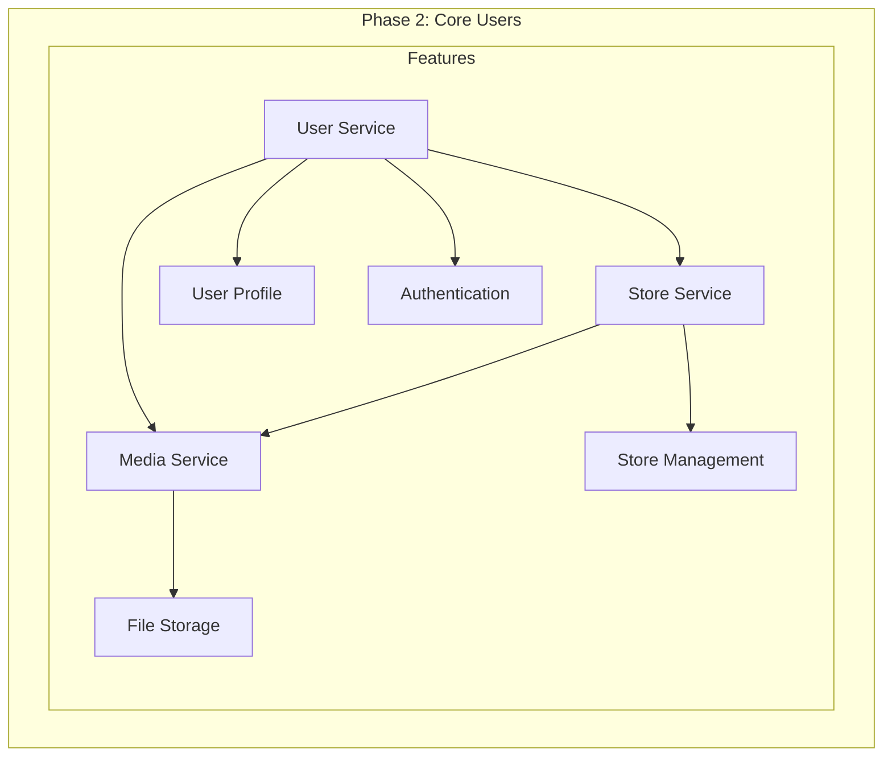
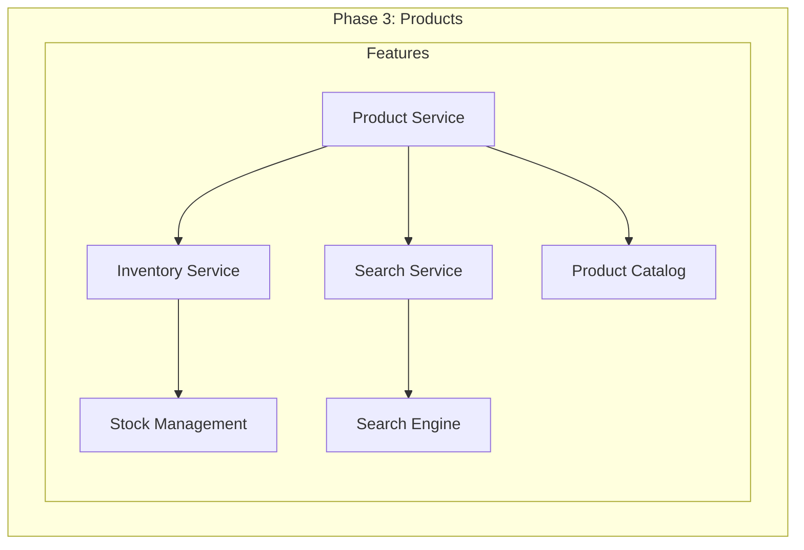
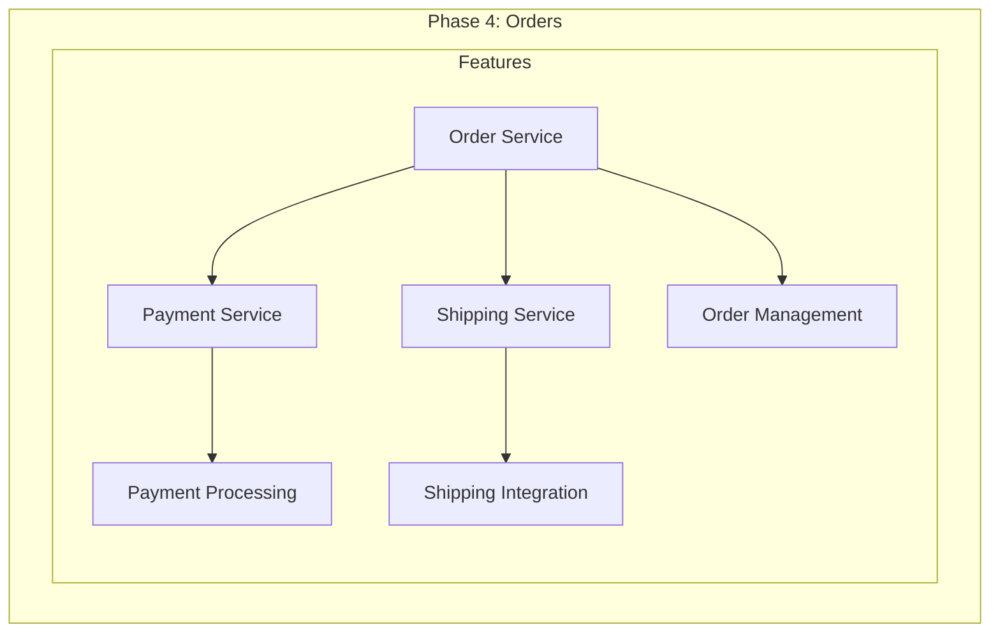
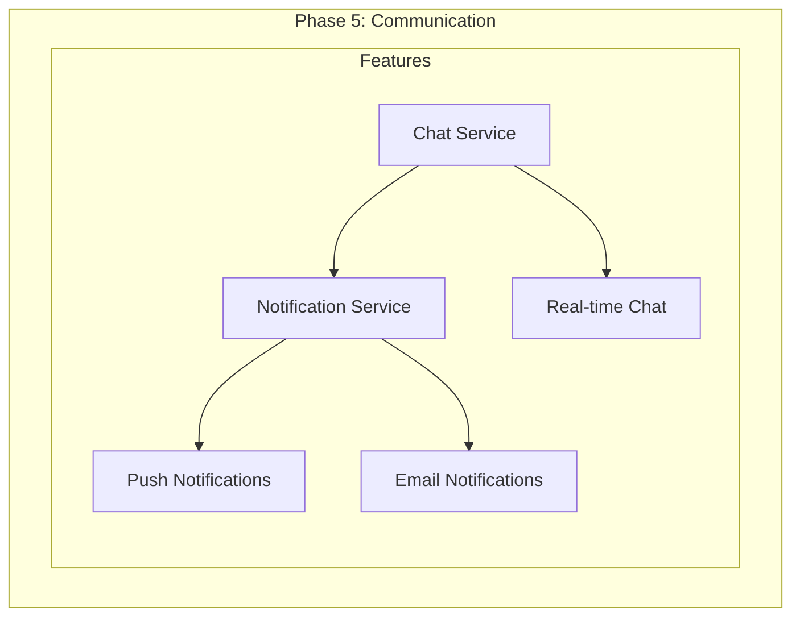
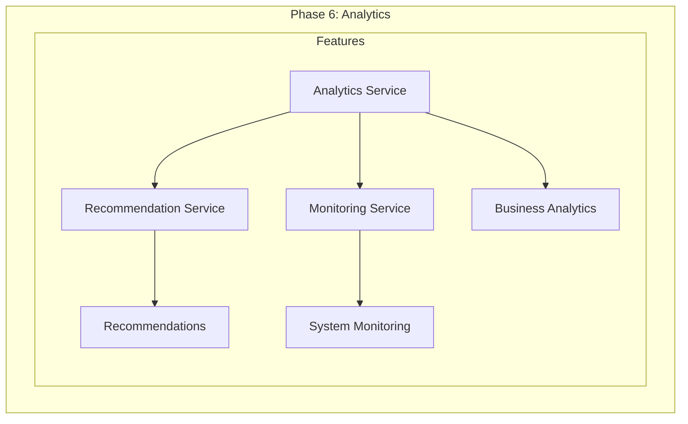

# Development Phases
แผนการพัฒนาระบบ Marketplace Microservices

## Phase Overview

## 1. Infrastructure & Foundation (พื้นฐานระบบ)

### ขั้นตอนการพัฒนา
1. **Setup Kubernetes Cluster**
   - สร้าง GKE cluster
   - ติดตั้ง Helm
   - กำหนด namespaces

2. **Database Setup**
   - PostgreSQL สำหรับข้อมูลที่ต้องการ consistency
   - MongoDB สำหรับข้อมูลที่ต้องการความยืดหยุ่น
   - Redis สำหรับ caching

3. **API Gateway & Authentication**
   - ติดตั้ง Kong
   - ตั้งค่า Firebase Authentication
   - กำหนด security policies

4. **Monitoring Setup**
   - ติดตั้ง Prometheus
   - ตั้งค่า Grafana dashboards
   - ติดตั้ง Loki สำหรับ log aggregation

## 2. Core User Management (ระบบผู้ใช้หลัก)

### ขั้นตอนการพัฒนา
1. **User Service**
   - ระบบลงทะเบียน
   - ระบบจัดการโปรไฟล์
   - การยืนยันตัวตน

2. **Store Service**
   - สร้างและจัดการร้านค้า
   - จัดการข้อมูลร้านค้า
   - ระบบจัดการสิทธิ์

3. **Media Service (Basic)**
   - อัพโหลดรูปภาพ
   - จัดการไฟล์
   - เชื่อมต่อ Cloud Storage

## 3. Product Management (ระบบจัดการสินค้า)

### ขั้นตอนการพัฒนา
1. **Product Service**
   - ระบบจัดการสินค้า
   - จัดการหมวดหมู่
   - ระบบ variants

2. **Inventory Management**
   - ระบบจัดการสต็อก
   - การแจ้งเตือนสต็อก
   - ประวัติการปรับสต็อก

3. **Search Service**
   - Elasticsearch setup
   - ระบบค้นหาพื้นฐาน
   - Filters และ Facets

## 4. Order System (ระบบสั่งซื้อ)

### ขั้นตอนการพัฒนา
1. **Order Service**
   - ระบบตะกร้าสินค้า
   - การสร้างคำสั่งซื้อ
   - ติดตามสถานะ

2. **Payment Integration**
   - เชื่อมต่อระบบชำระเงิน
   - ระบบคืนเงิน
   - ประวัติการชำระเงิน

3. **Shipping System**
   - เชื่อมต่อขนส่ง
   - คำนวณค่าส่ง
   - ติดตามการจัดส่ง

## 5. Communication System (ระบบการสื่อสาร)

### ขั้นตอนการพัฒนา
1. **Chat System**
   - Real-time messaging
   - Chat history
   - File sharing

2. **Notification System**
   - Push notifications
   - Email notifications
   - SMS notifications

## 6. Analytics & Enhancement (การวิเคราะห์และพัฒนา)

### ขั้นตอนการพัฒนา
1. **Analytics System**
   - รวบรวมข้อมูล
   - วิเคราะห์พฤติกรรม
   - รายงานธุรกิจ

2. **Recommendation System**
   - แนะนำสินค้า
   - Personalization
   - A/B Testing

## การทดสอบและ Quality Assurance

### Unit Testing
- ทดสอบแต่ละ service
- ทดสอบ business logic
- ทดสอบ edge cases

### Integration Testing
- ทดสอบการทำงานร่วมกัน
- ทดสอบ API endpoints
- ทดสอบ event flows

### Performance Testing
- Load testing
- Stress testing
- Scalability testing

### Security Testing
- Penetration testing
- Security scanning
- Authentication testing

## Monitoring และ Maintenance

### System Monitoring
- Resource usage
- Error rates
- Response times

### Business Monitoring
- User metrics
- Order metrics
- Revenue metrics

### Maintenance
- Regular updates
- Security patches
- Performance optimization

## Scaling Strategy

### Horizontal Scaling
- Auto-scaling policies
- Load balancing
- Resource management

### Database Scaling
- Sharding
- Read replicas
- Caching strategy

## Disaster Recovery

### Backup Strategy
- Regular backups
- Point-in-time recovery
- Geo-replication

### Recovery Plans
- Failover procedures
- Data recovery
- Service restoration
