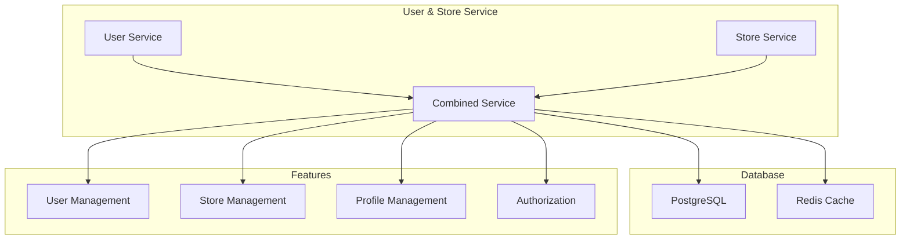
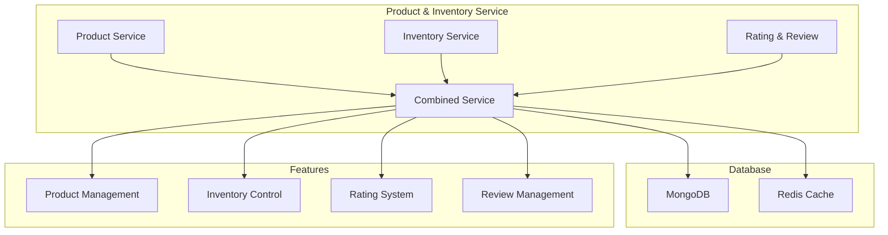
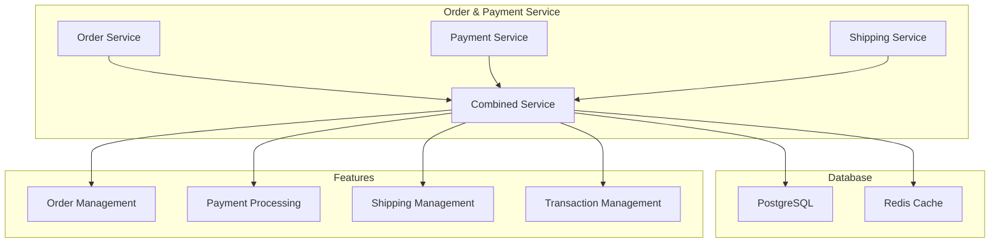
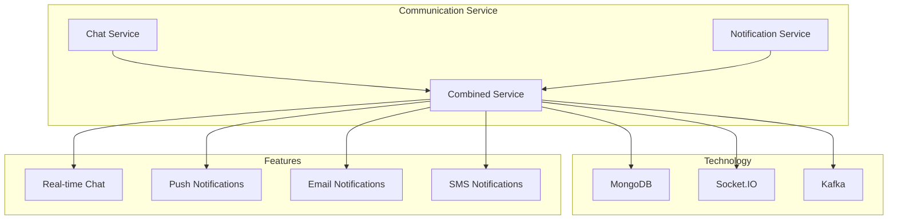
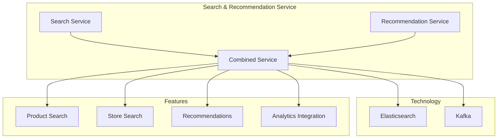
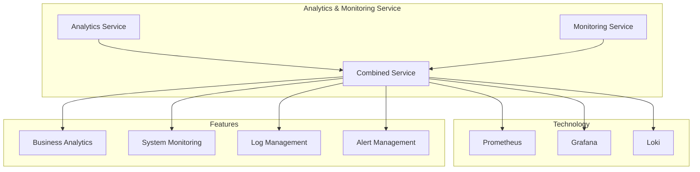
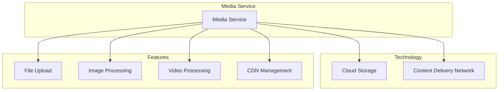
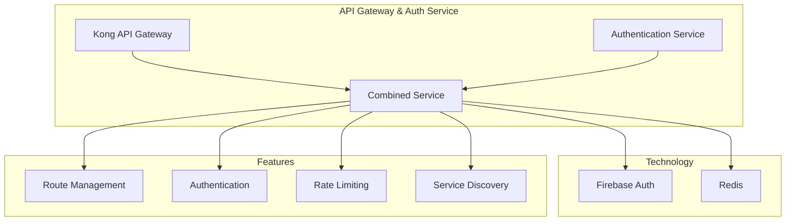

# Service Consolidation Guide
คู่มือการรวม Services

## Overview
จากการวิเคราะห์โครงสร้างเดิมที่มี 17 microservices เราสามารถรวมให้เหลือ 8 services หลักเพื่อลดความซับซ้อนและเพิ่มประสิทธิภาพของระบบ

## Service Consolidation Map
แผนผังการรวม Services

### 1. User & Store Service

**เหตุผลในการรวม:**
- User และ Store มีความสัมพันธ์ใกล้ชิด (User เป็นเจ้าของ Store)
- ใช้ PostgreSQL เป็นฐานข้อมูลเดียวกัน
- ลดความซับซ้อนในการจัดการสิทธิ์และความสัมพันธ์

### 2. Product & Inventory Service

**เหตุผลในการรวม:**
- ข้อมูลสินค้า สต็อก และรีวิวมีความเกี่ยวข้องกันโดยตรง
- ใช้ MongoDB เพื่อความยืดหยุ่นในการจัดเก็บข้อมูล
- ลดการสื่อสารระหว่าง services

### 3. Order & Payment Service

**เหตุผลในการรวม:**
- เป็นส่วนหนึ่งของ transaction เดียวกัน
- ใช้ PostgreSQL สำหรับความถูกต้องของข้อมูลการเงิน
- ลดความซับซ้อนในการจัดการ distributed transactions

### 4. Communication Service

**เหตุผลในการรวม:**
- จัดการการสื่อสารทั้งระบบในที่เดียว
- ใช้ Socket.IO สำหรับการสื่อสารแบบ real-time
- ลดความซ้ำซ้อนในการจัดการการแจ้งเตือน

### 5. Search & Recommendation Service

**เหตุผลในการรวม:**
- ใช้ Elasticsearch ร่วมกัน
- มีการใช้ข้อมูลร่วมกันในการวิเคราะห์
- เพิ่มประสิทธิภาพในการค้นหาและแนะนำ

### 6. Analytics & Monitoring Service

**เหตุผลในการรวม:**
- รวมการจัดการ metrics และ logs
- ใช้ stack เดียวกัน (Prometheus, Grafana, Loki)
- เพิ่มประสิทธิภาพในการวิเคราะห์และติดตาม

### 7. Media Service (Standalone)

**เหตุผลที่แยก:**
- จัดการไฟล์มีเดียโดยเฉพาะ
- ต้องการ scalability แยกต่างหาก
- มีการใช้ Cloud Storage และ CDN

### 8. API Gateway & Auth Service

**เหตุผลในการรวม:**
- เป็น entry point เดียวของระบบ
- จัดการการยืนยันตัวตนและการเข้าถึง API
- ลดความซับซ้อนในการจัดการ security

## ข้อดีของการรวม Services

1. **ลดความซับซ้อน**
   - การ deploy และดูแลระบบง่ายขึ้น
   - ลดจำนวน services ที่ต้องจัดการ

2. **เพิ่มประสิทธิภาพ**
   - ลดการสื่อสารระหว่าง services
   - ลดการใช้ทรัพยากร

3. **ลดค่าใช้จ่าย**
   - ใช้ทรัพยากรน้อยลง
   - ลดค่า maintenance

4. **จัดการ Transaction ง่ายขึ้น**
   - ลดความซับซ้อนของ distributed transactions
   - เพิ่มความน่าเชื่อถือของข้อมูล

## ข้อควรระวัง

1. **Domain Boundaries**
   - ต้องออกแบบขอบเขตให้ชัดเจน
   - แยก business logic ให้เหมาะสม

2. **Scalability**
   - ต้องออกแบบให้ scale ได้อย่างอิสระ
   - เตรียมรับมือ load ที่เพิ่มขึ้น

3. **Database Design**
   - แยก schema ให้ชัดเจน
   - ออกแบบ indexes ให้เหมาะสม

4. **Error Handling**
   - จัดการ errors ให้ครอบคลุม
   - มี fallback mechanisms

## การ Monitor และ Maintenance

1. **Performance Monitoring**
   - ติดตาม metrics ของแต่ละ service
   - วิเคราะห์ bottlenecks

2. **Log Management**
   - รวบรวม logs จากทุกส่วน
   - วิเคราะห์ปัญหาที่เกิดขึ้น

3. **Scaling Strategy**
   - กำหนด scaling rules
   - monitor resource usage

4. **Backup Strategy**
   - สำรองข้อมูลแต่ละ service
   - ทดสอบการกู้คืนข้อมูล
