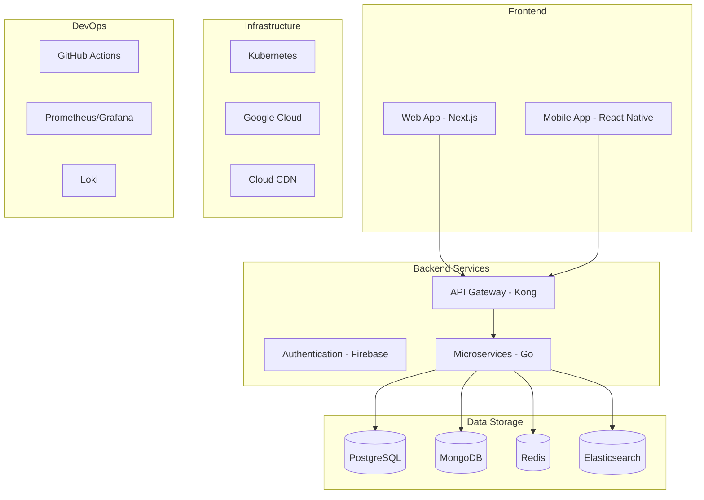

# Tech Stack & Infrastructure
เทคโนโลยีและโครงสร้างพื้นฐาน

## Overview

## Frontend Technology Stack

### Web Application
- **Framework**: Next.js 14
- **Language**: TypeScript 5
- **State Management**: Redux Toolkit
- **UI Components**: 
  - Tailwind CSS
  - Headless UI
  - Material UI
- **Form Handling**: React Hook Form
- **API Client**: Axios
- **Testing**: 
  - Jest
  - React Testing Library

### Mobile Application
- **Framework**: React Native
- **Language**: TypeScript
- **Navigation**: React Navigation
- **State Management**: Redux Toolkit
- **UI Components**:
  - React Native Paper
  - Native Base
- **Testing**:
  - Jest
  - React Native Testing Library

## Backend Technology Stack

### API Gateway
- **Kong Gateway**
  - Rate Limiting
  - Authentication
  - SSL/TLS
  - API Analytics

### Authentication
- **Firebase Authentication**
  - Email/Password
  - Google Sign-In
  - Apple Sign-In
  - LINE Login
  - Phone Authentication

### Microservices
- **Language**: Go 1.21
- **Framework**: Fiber
- **Libraries**:
  - GORM
  - go-redis
  - zap (logging)
  - validator
  - wire (DI)
- **Testing**:
  - testify
  - gomock
  - httptest

## Data Storage

### PostgreSQL
- **Version**: 15
- **Use Cases**:
  - User data
  - Order transactions
  - Payment records
- **Features**:
  - Partitioning
  - Read replicas
  - Point-in-time recovery

### MongoDB
- **Version**: 6.0
- **Use Cases**:
  - Product catalog
  - User preferences
  - Reviews & ratings
- **Features**:
  - Sharding
  - Atlas integration
  - Time series collections

### Redis
- **Version**: 7.0
- **Use Cases**:
  - Session management
  - Caching
  - Rate limiting
- **Features**:
  - Redis Cluster
  - Redis Sentinel
  - RedisJSON

### Elasticsearch
- **Version**: 8.x
- **Use Cases**:
  - Product search
  - Full-text search
  - Analytics
- **Features**:
  - Relevance tuning
  - Aggregations
  - Suggestions

## Message Broker

### Apache Kafka
- **Version**: 3.5
- **Use Cases**:
  - Event sourcing
  - Message queuing
  - Stream processing
- **Features**:
  - Multi-cluster replication
  - Exactly-once semantics
  - Stream processing

## Infrastructure

### Kubernetes
- **Version**: 1.27
- **Components**:
  - GKE Autopilot
  - Helm
  - Istio Service Mesh
- **Features**:
  - Auto-scaling
  - Load balancing
  - Secret management

### Google Cloud Platform
- **Services**:
  - Google Kubernetes Engine
  - Cloud Storage
  - Cloud CDN
  - Cloud SQL
  - Cloud Monitoring
- **Features**:
  - Multi-region deployment
  - Auto-scaling
  - Load balancing

## DevOps & Monitoring

### CI/CD
- **GitHub Actions**
  - Automated testing
  - Docker builds
  - Kubernetes deployment
- **ArgoCD**
  - GitOps workflow
  - Deployment automation
  - Configuration management

### Monitoring
- **Prometheus**
  - Metrics collection
  - Alert management
  - PromQL
- **Grafana**
  - Dashboards
  - Alerts
  - Visualization
- **Loki**
  - Log aggregation
  - Log querying
  - Alert integration

### Security
- **Tools**:
  - Vault (secrets)
  - Cert-manager (SSL)
  - Security scanning
- **Practices**:
  - Zero trust security
  - Encryption at rest
  - Regular security audits

## Development Tools

### IDE & Extensions
- **VSCode**
  - Go
  - ESLint
  - Prettier
  - Docker
  - Kubernetes
- **GoLand**
  - Professional IDE for Go

### API Development
- **Tools**:
  - Postman
  - Swagger UI
  - GraphQL Playground
- **Documentation**:
  - OpenAPI 3.0
  - GraphQL Schema

### Database Tools
- **Management**:
  - pgAdmin
  - MongoDB Compass
  - RedisInsight
- **Migration**:
  - golang-migrate
  - Flyway

## Version Control

### Git Flow
- **Branches**:
  - main
  - develop
  - feature/*
  - release/*
  - hotfix/*
- **Tools**:
  - GitHub
  - Git LFS
  - Conventional Commits

## Infrastructure as Code

### Terraform
- **Providers**:
  - Google Cloud
  - Kubernetes
  - Helm
- **Modules**:
  - Network
  - Compute
  - Database
  - Security

### Helm Charts
- **Components**:
  - Application services
  - Databases
  - Monitoring stack
- **Features**:
  - Version control
  - Dependency management
  - Configuration templates

## Backup & Recovery

### Backup Strategy
- **Database**:
  - Daily full backups
  - Point-in-time recovery
  - Cross-region replication
- **Application**:
  - Configuration backups
  - Secrets backup
  - Disaster recovery plan

### Recovery Procedures
- **RTO/RPO**:
  - RTO: 4 hours
  - RPO: 15 minutes
- **Procedures**:
  - Failover process
  - Data recovery
  - Service restoration

## Scaling Strategy

### Application Scaling
- **Horizontal**:
  - Pod autoscaling
  - Node autoscaling
  - Regional scaling
- **Vertical**:
  - Resource optimization
  - Performance tuning
  - Capacity planning

### Database Scaling
- **Strategies**:
  - Read replicas
  - Sharding
  - Connection pooling
- **Tools**:
  - PgBouncer
  - ProxySQL
  - MongoDB Atlas
